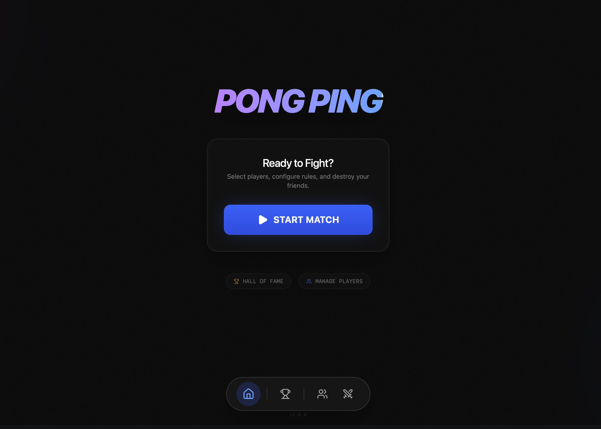

# 🏓 Pong Ping

> **The Ultimate Local-First Desktop Ping Pong Match Tracker**
>
> *Fast, beautiful, and offline-ready. Built for the office, the garage, or the pro arena.*




---

## 🚀 Introduction

**Pong Ping** is a modern desktop application designed to elevate your Ping Pong (Table Tennis) experience. Whether you're playing a quick 11-point match or a heated tournament deciding who buys lunch, Pong Ping handles the scorekeeping, statistics, and history locally on your machine.

Built with **Tauri v2**, it combines the performance and security of **Rust** with the rich UI capabilities of **React**. Because it uses **SQLite** for local persistence, your data never leaves your device unless you want it to.

## ✨ Key Features

*   **⚡ Real-Time Score Tracking:** Minimalist, keyboard-friendly interface for tracking points during a match.
*   **👥 Singles & Doubles Support:**
    *   **1v1:** Classic head-to-head duels.
    *   **2v2:** Full support for doubles matches (recently added!).
*   **📊 Detailed Statistics:**
    *   Track Win/Loss ratios.
    *   "Nemesis" tracking (know who beats you the most).
    *   Match history log with timestamps.
*   **⚙️ Custom Game Modes:**
    *   Configure points to win (11, 21, custom).
    *   Adjust serve rotation rules.
    *   Toggle Deuce rules on/off.
*   **🎨 Player Personalization:** Custom avatars, colors, and fun nicknames for every player.
*   **🔒 Local First:** All data is stored in a local SQLite database (`pong_ping.db`). No internet required.
*   **🔄 Auto-Updates:** Integrated update mechanism via GitHub Releases.

## 🛠️ Tech Stack

This project leverages a hybrid architecture for maximum performance and developer experience:

| Type | Technology | Description |
| :--- | :--- | :--- |
| **Core** | [Tauri v2](https://tauri.app/) | Application framework |
| **Backend** | [Rust](https://www.rust-lang.org/) | System logic, commands, security |
| **Frontend** | [React 18](https://react.dev/) | UI Library |
| **Styling** | [Tailwind CSS v4](https://tailwindcss.com/) | Styling & Design System |
| **Database** | [SQLite](https://www.sqlite.org/) | Local storage via `tauri-plugin-sql` |
| **ORM** | [SQLx](https://github.com/launchbadge/sqlx) | Type-safe SQL queries in Rust |
| **Bundler** | [Vite](https://vitejs.dev/) | Fast build tool |

## 💻 Getting Started (Development)

Follow these steps to set up the environment and run the app locally.

### Prerequisites

1.  **Node.js** (v18+) and `npm` (or `bun`/`yarn`).
2.  **Rust & Cargo:** Install via [rustup](https://rustup.rs/).
3.  **System Dependencies:** Follow the [Tauri Prerequisites guide](https://tauri.app/v1/guides/getting-started/prerequisites) for your OS (Xcode for macOS, build-essential for Linux, etc.).

### Installation

Clone the repository and install dependencies:

```bash
git clone https://github.com/your-username/pong-ping.git
cd pong-ping

# Install frontend dependencies
npm install

# Install Rust dependencies (happens automatically on first run, but you can force it)
cd src-tauri && cargo fetch
```

### Running in Development Mode

This command will start the Vite frontend server and the Tauri backend window simultaneously:

```bash
npm run tauri dev
```

*Note: The application will automatically create the SQLite database file and apply migrations (`src-tauri/migrations/`) on the first launch.*

## 📦 Building for Production

To create an optimized executable for your current operating system:

```bash
npm run tauri build
```

The output binary (dmg, exe, or deb) will be located in:
`src-tauri/target/release/bundle/`

### CI/CD Pipeline

This project is configured with **GitHub Actions** to automate releases. When a new tag is pushed (e.g., `v1.0.0`), the workflow:
1.  Builds the app for macOS, Windows, and Linux.
2.  Drafts a GitHub Release.
3.  Uploads the assets and update signatures for auto-updates.

## 📂 Project Structure

```text
pong-ping/
├── src/                    # Frontend (React)
│   ├── components/         # UI Components (Dashboard, GameScreen, etc.)
│   ├── lib/                # Utilities and Game Config
│   ├── services/           # API bridges to Rust backend
│   └── App.jsx             # Main Router
├── src-tauri/              # Backend (Rust)
│   ├── migrations/         # SQL migration files
│   ├── src/
│   │   ├── commands.rs     # Exposed commands to Frontend
│   │   ├── models.rs       # Rust structs (User, Match, GameMode)
│   │   └── main.rs         # Entry point
│   ├── Cargo.toml          # Rust dependencies
│   └── tauri.conf.json     # App configuration
└── package.json            # Node dependencies and scripts
```

## 📄 License

This project is licensed under the **MIT License**. See the [LICENSE](LICENSE) file for details.

---

*Happy Pinging! 🏓*
